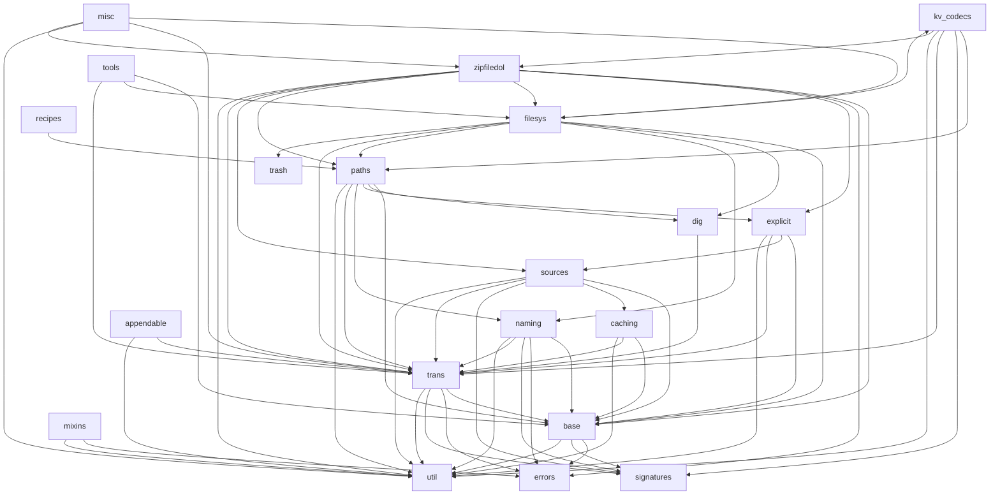

# dol Architecture & Design Map

> An authoritative, code-verified map of the `dol` library, intended for (1) a
> redesign/refactoring effort and (2) authoring "dev skills" (AI-agent tooling for
> developers working **on** dol). All non-obvious claims cite `file:line` against the
> **current** source (verified 2026-07, version 0.3.46, Python ≥ 3.10).

---

## 1. Purpose & scope

This document is the **structural/mechanical** reference for dol's Python source: every
module, the public API surface, the class hierarchy, and — in depth — the
`wrap_kvs`/`store_decorator`/codec machinery that is the heart of the library. It is
deliberately factual and line-cited so it can be trusted when refactoring or when writing
agent tooling that edits dol source.

It **complements, does not repeat** the existing `misc/docs`:

| For… | Read | This doc adds |
|---|---|---|
| Language-agnostic "what/why" (middleware, KV pipeline, Russian dolls) | [general_design.md](general_design.md) | — |
| Python architecture narrative + design critique | [dol_design.md](dol_design.md) | Verifies it against code; flags staleness (§ below) |
| GitHub issues/discussions themes | [issues_and_discussions.md](issues_and_discussions.md) | Corrects the Issue #9 root-cause (§5.4) |
| The split-store / content-metadata problem | [dol_content_metadata_bifurcation.md](dol_content_metadata_bifurcation.md) | — |
| Dead code / coverage tracker | [code-quality-improvements.md](code-quality-improvements.md) | Adds new debt found (§11) |
| Doc index | [dol_misc_docs_guide.md](dol_misc_docs_guide.md) | Should be updated to list this file |

### Staleness / inaccuracies found in existing docs

- **`issues_and_discussions.md` §1a states the wrong root cause for Issue #9.** It says
  `wrap_kvs` "checks whether `obj_of_data` has 1 or 2+ required args". It does **not**.
  The `(data)` vs `(self, data)` decision is made by inspecting whether the transform's
  **first parameter *name*** is one of `{"self", "store", "mapping"}` (`self_names`,
  `dol/trans.py:1617`). See §5.4 for the verified mechanism and why `bytes.decode` breaks.
- **`dol_design.md` cites `wrap_kvs` at `trans.py:1801` and `store_decorator` at
  `trans.py:130`.** `store_decorator` is still `:130`; `wrap_kvs` is now `:1813`
  (decorator) / `:1814` (def). `Codec` is now `:3374` (doc says `:3362`).
- **`dol_design.md`'s `cache_this` examples are stale.** The current signature is
  `cache_this(func=None, *, cache, key, pre_cache, as_property, ignore, serialize,
  deserialize)` (`dol/caching.py:1055`). The whole `KeyStrategy`/`CachedProperty`/
  `CachedMethod` subsystem (`caching.py:126–1053`) is undocumented in existing docs.
- **`code-quality-improvements.md` LOC figures are per-*statement* (coverage), not raw
  lines** — it lists `trans.py` as "789 lines" etc. Raw line counts are much larger
  (see §2). Its dead-code items were spot-checked and are still present (§11).
- **`dol_design.md` claims `Store.__getattr__` returns `getattr(self.store, attr)`.** The
  real implementation guards against pickling recursion via
  `getattr(object.__getattribute__(self, "store"), attr)` (`dol/base.py:617`).

---

## 2. Module map

LOC = raw `wc -l`. "Internal deps" = other `dol.*` modules imported at **module load
time** (docstring-only and inline-function imports excluded).

| Module | LOC | Purpose | Key public exports | Internal deps |
|---|---:|---|---|---|
| `__init__.py` | 208 | Public API surface; deprecation shim via module `__getattr__` | (re-exports — see §3) | everything |
| `base.py` | 1140 | Class hierarchy + hook protocol; `kv_walk`; delegation machinery | `Collection`, `KvReader`, `KvPersister`, `Store`, `MappingViewMixin`, `kv_walk`, `Stream` | errors, signatures, util |
| `trans.py` | 3492 | **The core.** `wrap_kvs`, `store_decorator`, `filt_iter`, `cached_keys`, `Codec`/`ValueCodec`/`KeyCodec`, `kv_wrap`, path-access adders | `wrap_kvs`, `filt_iter`, `cached_keys`, `kv_wrap`, `store_decorator`, `flatten`, `add_path_get/access`, `mk_read_only`, `Codec`* | base, errors, signatures, util |
| `caching.py` | 2675 | Caching layers: `cache_this`, `cache_vals`, `store_cached`, `WriteBackChainMap`, key-strategy protocol | `cache_this`, `cache_vals`, `store_cached`, `WriteBackChainMap`, `flush_on_exit`, `ensure_clear_to_kv_store` | base, trans, util |
| `paths.py` | 2270 | Path/nested access: `KeyTemplate`, `KeyPath`, `path_get/set/filter`, relative-path stores | `KeyTemplate`, `KeyPath`, `path_get`, `path_set`, `path_filter`, `mk_relative_path_store`, `flatten_dict`, `leaf_paths`, `add_prefix_filtering` | base, dig, explicit, naming, trans, util |
| `naming.py` | 1243 | **Older** parametrized-key system: `StrTupleDict` (str↔tuple↔dict). Overlaps `KeyTemplate` (§7) | `StrTupleDict`, `mk_store_from_path_format_store_cls` | base, errors, signatures, trans, util |
| `sources.py` | 1172 | KV views over disparate sources; composite stores | `FlatReader`, `FanoutReader`, `FanoutPersister`, `CascadedStores`, `MultiSource`, `SequenceKvReader`, `FuncReader`, `ObjReader`, `Attrs` | base, caching, signatures, trans, util |
| `filesys.py` | 867 | Filesystem stores | `Files`, `FilesReader`, `TextFiles`, `PickleFiles`, `JsonFiles`, `Jsons`, `DirReader`, `mk_dirs_if_missing`, `subfolder_stores` | base, dig, kv_codecs, naming, paths, trans, trash |
| `kv_codecs.py` | 596 | Ready-made codec namespaces | `ValueCodecs`, `KeyCodecs` (`KeyValueCodecs` exists but **unexported**) | paths, signatures, trans, util, zipfiledol |
| `signatures.py` | 5403 | `Sig` signature-calculus engine (used everywhere) | `Sig`, `KO`/`PK`/… kind aliases, `Param`, `call_forgivingly` | (none) |
| `util.py` | 2356 | Grab-bag utilities | `Pipe`, `lazyprop`, `partialclass`, `groupby`, `regroupby`, `instance_checker`, `LiteralVal`, `chain_get`, `written_bytes` | (none — self-contained) |
| `zipfiledol.py` | 994 | Zip/tar archive stores + compression codecs | `ZipFiles`, `ZipReader`, `FilesOfZip`, `FlatZipFilesReader`, `zip_compress`, `tar_compress` | base, errors, explicit, filesys, paths, sources, trans, util |
| `appendable.py` | 673 | Append semantics for stores | `appendable`, `mk_item2kv_for`, `Extender` | trans, util |
| `explicit.py` | 291 | Stores driven by explicit key data | `ExplicitKeyMap`, `KeysReader`, `invertible_maps` | base, sources, trans, util |
| `tools.py` | 585 | Misc store add-ons | `store_aggregate`, `iSliceStore`, `Forest` | base, filesys, trans |
| `misc.py` | 462 | Read/write misc sources (URLs, dropbox) | `MiscGetter`, `MiscGetterAndSetter`, `get_obj` | filesys, trans, util, zipfiledol |
| `dig.py` | 206 | Introspect wrapper layers | `trace_getitem`, `inner_most`, `layers` | trans |
| `mixins.py` | 248 | Legacy mixin classes (mostly superseded by `wrap_kvs`) | `ReadOnlyMixin`, `IdentityKvWrapMixin`, `OverWritesNotAllowedMixin` | errors, util |
| `errors.py` | 170 | Exception hierarchy | `KeyValidationError`, `OperationNotAllowed`, `WritesNotAllowed`, … | (none) |
| `trash.py` | 237 | Cross-platform trash/recycle delete | `get_platform_trash_func`, `make_safe_delete_func` | (none) |
| `recipes.py` | 5 | Thin alias module | `search_paths` (= `paths.path_filter`) | paths |

`*` `Codec`/`ValueCodec`/`KeyCodec`/`KeyValueCodec` live in `trans.py` but are **not**
top-level `dol` exports; import from `dol.trans` (see §3, §6).

### Internal dependency graph

Foundation layer (no internal deps): `signatures`, `util`, `errors`, `trash`.



Notes on the graph:
- **`base` and `trans` are the two hubs.** Almost everything depends on `trans`;
  `trans` depends only on `base` + the foundation. There is **no** circular import
  between `trans` and `paths` (the `from dol.paths` lines in `trans.py` are inside
  doctests only — `trans.py:2661,2793`).
- **`paths` ↔ `explicit` are mutually entangled** (`paths` imports `explicit`;
  `explicit` imports `sources` which is independent) — but `paths` also imports
  `naming` and `dig`, making it one of the most coupled modules.
- **`zipfiledol` and `filesys` are the heaviest leaves**, each pulling in 6–8 internal
  modules. `filesys` imports `kv_codecs` which imports `zipfiledol` — a long chain, but
  acyclic.

---

## 3. Public API surface (`dol/__init__.py`)

Grouped by concern. All names below are importable as `from dol import <name>`.

**Base classes / protocol** (`base.py`): `Collection`, `MappingViewMixin`, `KvReader`,
`KvPersister`, `Reader` (alias of `KvReader`), `Persister` (alias of `KvPersister`),
`Store`, `kv_walk`, `KT`, `VT`, `BaseKeysView`, `BaseValuesView`, `BaseItemsView`.

**Wrappers / transforms** (`trans.py`): `wrap_kvs`, `kv_wrap`, `filt_iter`,
`cached_keys`, `cache_iter` (deprecating), `add_decoder`, `add_ipython_key_completions`,
`insert_hash_method`, `add_path_get`, `add_path_access`, `flatten`, `disable_delitem`,
`disable_setitem`, `mk_read_only`, `add_aliases`, `insert_aliases`,
`add_missing_key_handling`, `store_decorator`, `redirect_getattr_to_getitem`.

**Codecs** (`kv_codecs.py`): `ValueCodecs`, `KeyCodecs`.

**Caching** (`caching.py`): `cache_this`, `add_extension`, `lru_cache_method`,
`WriteBackChainMap`, `mk_cached_store` (old alias), `cache_vals`, `store_cached`,
`store_cached_with_single_key`, `ensure_clear_to_kv_store`, `flush_on_exit`,
`mk_write_cached_store`.

**Paths / naming** (`paths.py`, `naming.py`): `flatten_dict`, `leaf_paths`,
`KeyTemplate`, `mk_relative_path_store`, `KeyPath`, `paths_getter`, `path_get`,
`path_set`, `path_filter`, `add_prefix_filtering`, `StrTupleDict`,
`mk_store_from_path_format_store_cls`.

**Sources / composite** (`sources.py`): `FlatReader`, `SequenceKvReader`, `FuncReader`,
`Attrs`, `ObjReader`, `FanoutReader`, `FanoutPersister`, `CascadedStores`, `MultiSource`.

**Filesystem** (`filesys.py`): `Files`, `FilesReader`, `TextFiles`, `PickleFiles`,
`JsonFiles`, `Jsons`, `DirReader`, `ensure_dir`, `mk_dirs_if_missing`,
`MakeMissingDirsStoreMixin`, `resolve_path`, `resolve_dir`, `temp_dir`,
`create_directories`, `process_path`, `subfolder_stores`.

**Zip** (`zipfiledol.py`): `ZipReader`, `ZipInfoReader`, `FilesOfZip`,
`FileStreamsOfZip`, `FlatZipFilesReader`, `ZipFiles`, `ZipStore` (alias),
`ZipFileStreamsReader`, `zip_compress`, `zip_decompress`, `to_zip_file`,
`remove_mac_junk_from_zip`, `tar_compress`, `tar_decompress`.

**Utils** (`util.py`): `Pipe`, `lazyprop`, `partialclass`, `groupby`, `regroupby`,
`igroupby`, `instance_checker`, `chain_get`, `non_colliding_key`, `get_app_folder`,
`get_app_config_folder`, `AttributeMapping`, `AttributeMutableMapping`,
`not_a_mac_junk_path`, `written_bytes`, `written_key`, `read_from_bytes`.

**Other**: `store_aggregate` (`tools.py`), `mk_item2kv_for`, `appendable`
(`appendable.py`), `trace_getitem` (`dig.py`), `ExplicitKeyMap`, `invertible_maps`,
`KeysReader` (`explicit.py`).

**Deprecation shim**: `__init__.py:197` defines a module-level `__getattr__` that maps the
removed `get_app_data_folder` → `get_app_config_folder` with a `DeprecationWarning`.

### Export gaps to flag

- **Documented / expected but NOT top-level exported**: `Codec`, `ValueCodec`,
  `KeyCodec`, `KeyValueCodec` (must use `from dol.trans import …`). `llms.txt` lists them
  under "Core API / trans.py" which reads as if they were `dol`-level.
- **Exists but unexported**: `KeyValueCodecs` namespace (`kv_codecs.py:575`) — and its two
  factories `key_based`/`extension_based` are **unimplemented stubs** (§6, §11).
- **`Stream`** (`base.py:1021`) — a layer-able stream interface — is public-quality but not
  exported anywhere.
- **`FirstArgIsMapping`** (`trans.py:2113`) is defined but unused (`# TODO: Use this for
  it's intent!`, `:2121`) — the intended clean fix for Issue #9/#12 that was never wired in.

---

## 4. Class hierarchy & hook protocol

```
collections.abc.Collection                      (ABC: __iter__, __contains__, __len__)
    └─ dol.base.Collection            base.py:86    + head(); default __len__/__contains__ by iteration
         └─ dol.base.KvReader         base.py:156   (MappingViewMixin, Collection, Mapping)
              │                                     + __getitem__, keys/values/items; __reversed__ → NotImplementedError
              └─ dol.base.KvPersister base.py:196   (KvReader, MutableMapping) + __setitem__/__delitem__; clear() DISABLED
                   └─ dol.base.Store  base.py:469   wraps self.store; adds the 4 transform hooks
```

Aliases: `Reader = KvReader` (`base.py:191`), `Persister = KvPersister` (`:239`),
`KvStore = Store` (`:737`).

**Mixins & helpers (base.py):**
- `MappingViewMixin` (`:141`) — swap `KeysView`/`ValuesView`/`ItemsView` *class attributes*
  to customize views instead of overriding `.keys()/.values()/.items()`.
- `DelegatedAttribute` (`:251`) + `delegate_to` (`:291`) + `delegator_wrap` (`:366`) —
  the delegation engine. `Store.wrap = classmethod(partial(delegator_wrap,
  delegation_attr="store"))` (`:611`) lets any Store carry its own wrapping method.
- `KeyValidationABC` (`:978`), `Stream` (`:1021`), `kv_walk` (`:768`).

**The hook protocol (the customization surface of `Store`):**

| Hook (default = `static_identity_method`) | Direction | Called by |
|---|---|---|
| `_id_of_key(k) → _id` | ingoing key | `__getitem__`, `__setitem__`, `__delitem__`, `__contains__` |
| `_key_of_id(_id) → k` | outgoing key | `__iter__` |
| `_data_of_obj(obj) → data` | ingoing value | `__setitem__` |
| `_obj_of_data(data) → obj` | outgoing value | `__getitem__` |

Defaults assigned at `base.py:600–603`. `__getitem__` (`:631`) also routes
`_errors_that_trigger_missing` (default `(KeyError,)`, `:607`) to `__missing__` if present.
`Store.__getattr__` (`:613`) delegates everything else to `self.store` using
`object.__getattribute__` to survive pickling; `__getstate__`/`__setstate__`
(`:723`/`:730`) persist only `_state_attrs = ["store", "_class_wrapper"]`.

**Three documented ways to inject hooks** (Store docstring, `base.py:469–578`): subclass
& override; assign callables to `_id_of_key` etc. on class/instance; or use `wrap_kvs`
(preferred). Convention per `.claude/rules/dol-conventions.md`: **prefer `wrap_kvs` over
subclassing `Store`.**

---

## 5. The `wrap_kvs` / `store_decorator` machinery — deep dive

This is the heart of dol and the root of Issues #9/#12/#18. Everything below is verified
against `dol/trans.py`.

### 5.1 `store_decorator` — the 4-way meta-decorator (`trans.py:130`)

`store_decorator(func)` takes a class-transforming `func(store=None, *, **kw)` and returns
a `wrapper` usable **four ways**: class-decorator, class-decorator-factory,
instance-decorator, instance-decorator-factory. Mechanism:

1. It computes an enriched signature `wrapper_sig` = `Sig(func)` merged with the
   "wrapper assignment" params `__module__, __name__, __qualname__, __doc__,
   __annotations__, __defaults__, __kwdefaults__` (all keyword-only, default `None`) —
   `trans.py:357`. These let callers rename/re-doc the produced class.
2. `wrapper(store=None, **kwargs)` (`:363`): if `store is None` → return
   `partial(_func_wrapping_store_in_cls_if_not_type, **kwargs)` (the **factory** branch);
   else call it directly.
3. `_func_wrapping_store_in_cls_if_not_type` (`:324`) is where **instance vs class** is
   resolved: if `store` is **not a type** (an instance), it builds `WrapperStore =
   func(Store, **kwargs)` then returns `WrapperStore(store_instance)` — i.e. the instance
   is first wrapped in a fresh `Store` subclass (`:337–338`). If `store` **is** a type,
   it asserts all-but-first args are keyword-only (`:340`) and calls `func(store, **kwargs)`.
4. After producing `r`, it copies over any explicitly-passed dunder specials (`:346`).

Consequence to know (documented in the docstring, `:219`): decorating an **instance**
returns an object whose type is `dol.base.Store` (or a subclass), **not** the original
type. `b.store == a` but `isinstance(b, type(a))` is `False`.

`double_up_as_factory` (`:36`) is the simpler cousin (direct-or-factory, no
instance-wrapping) used for plain function decorators; it validates first-arg-defaults-
to-`None` and all-else-keyword-only (`:90`).

### 5.2 `wrap_kvs` (`trans.py:1813` decorator / `:1814` def)

Decorated with `@store_decorator`, so it inherits the full 4-way behavior. Body is short
(`:1968–1978`): default `name` to the store's qualname, assemble `kwargs`, call
`_handle_codecs(kwargs)` to normalize codec/encoder/decoder aliases into the canonical
`key_of_id`/`id_of_key`/`obj_of_data`/`data_of_obj` (`:1981`), then delegate to
`_wrap_store(_wrap_kvs, kwargs)`.

Parameters (canonical + aliases resolved by `_handle_codecs`):
- Canonical: `key_of_id`, `id_of_key`, `obj_of_data`, `data_of_obj`, `preset`, `postget`.
- Codec shortcuts: `key_codec`/`value_codec` (a `Codec` → its `.encoder`/`.decoder` are
  split into the canonical pair), and the four `*_encoder`/`*_decoder` aliases.
  `_handle_codecs` raises `ValueError` if you pass both a codec and the canonical it maps
  to (`:2000`, `:2007`, …).
- Advanced: `outcoming_key_methods`, `outcoming_value_methods`, `ingoing_key_methods`,
  `ingoing_value_methods` — extra method names to also wrap alongside the defaults.

### 5.3 `_wrap_kvs` — applying transforms to the class (`trans.py:2124`)

For each of the four canonical transforms it wraps the corresponding hook method
(plus any extra `*_methods`): `_key_of_id`/`_obj_of_data` via `_wrap_outcoming`
(`:2141–2145`); `_id_of_key`/`_data_of_obj` via `_wrap_ingoing` (`:2147–2151`).
`postget`/`preset` are special-cased (`:2156–2190`): they replace `__getitem__`/
`__setitem__` directly so the transform receives `(k, data)`.

### 5.4 The signature-based conditioning — EXACTLY how `(data)` vs `(self, data)` is decided

This is the crux of Issue #9/#12. There are **two different mechanisms** in play:

**(A) For the four canonical transforms** (`key_of_id`, `id_of_key`, `obj_of_data`,
`data_of_obj`), `_wrap_outcoming` (`:1725`) and `_wrap_ingoing` (`:1792`) branch on
`_has_unbound_self(trans_func)`:
- If `False` → the wrapped method calls `trans_func(<value>)` (`:1768`, `:1799`).
- If `True` → it calls `trans_func(self, <value>)` (`:1779`, `:1805`).

`_has_unbound_self` (`:424`) returns `True` iff the function is not a type, is not a
bound method, **and** `_first_param_is_an_instance_param(params)` (`:418`) — which is
literally `list(params)[0] in self_names` where
**`self_names = frozenset(["self", "store", "mapping"])`** (`trans.py:1617`).

**So the decision is made by the *name of the first parameter*, not by argument count.**
This directly contradicts `issues_and_discussions.md`'s "1 or 2+ required args" claim.

Verified empirically:
```
signature(bytes.decode) == (self, /, encoding='utf-8', errors='strict')
_has_unbound_self(bytes.decode)  # True  (first param is named 'self')
wrap_kvs(dict, obj_of_data=bytes.decode)()['k']
#   → TypeError: descriptor 'decode' for 'bytes' objects doesn't apply to a 'dict' object
wrap_kvs(dict, obj_of_data=lambda x: bytes.decode(x))()['k']  # works: first param is 'x'
```
`bytes.decode` breaks purely because its first parameter is *named* `self`, so dol
mis-calls it as `bytes.decode(store_instance, data)`. Renaming the lambda parameter to
`self`/`store`/`mapping` would likewise flip the behavior. If `signature()` raises
`ValueError` (a signature-less builtin), `_has_unbound_self` returns `False` (`:458–460`).

**(B) For `postget`/`preset`**, `_wrap_kvs` uses a *hybrid*: `num_of_args(postget) < 2`
raises a `ValueError` for arity validation (`:2157`, `:2175`), and self-passing is again
decided by `_has_unbound_self` (`:2162`, `:2180`). So arity is validated but the
self-vs-no-self choice is still name-based.

**Why this is fragile (for redesign):**
- Behavior depends on an author's incidental parameter *name*, not intent.
- `functools.partial`, `Sig`-rewritten funcs, and C-builtins interact unpredictably.
- The intended clean fix — an explicit `FirstArgIsMapping` marker (a `LiteralVal`
  subclass, `trans.py:2113`) — exists but is **never consumed** anywhere in the code
  (`# TODO: Use this for it's intent!`). This is Issue #12's proposed solution, unwired.

### 5.5 Related: Issue #18 ("`self` is unwrapped")

`_wrap_outcoming`/`_wrap_ingoing` wrap **methods on the generated class** via
`super(store_cls, self).<method>(...)`. When a method *inside* a `wrap_kvs`-decorated
class calls `self[k]`, `self` is the inner (unwrapped) instance, so the transform pipeline
is bypassed. Workaround (per CLAUDE.md gotchas): re-apply the wrapper to `self` inside the
method, or route through the wrapped instance explicitly.

### 5.6 `kv_wrap` — the alternate interface (`trans.py:2395`)

`kv_wrap(trans_obj)` builds a wrapper from an object carrying `_key_of_id`/`_id_of_key`/
`_obj_of_data`/`_data_of_obj` attributes (a "trans object"), with chainable
`.outcoming_keys(...)`, `.ingoing_keys(...)`, `.outcoming_vals(...)`, `.ingoing_vals(...)`
attributes (`_kv_wrap_*` at `:2198–2348`). Same underlying `_wrap_outcoming`/`_wrap_ingoing`.

---

## 6. Codec system

Defined at the **end of `trans.py`** (`:3365–3451`); ready-made namespaces in
`kv_codecs.py`.

**Dataclasses** (`trans.py:3374`):
```python
@dataclass
class Codec(Generic[DecodedType, EncodedType]):
    encoder: Callable   # decoded → encoded  (the "write"/ingoing side)
    decoder: Callable   # encoded → decoded  (the "read"/outgoing side)
    __iter__   = (encoder, decoder)          # so `enc, dec = codec` works
    compose_with(other) → Pipe both sides    # __add__  (:3382)
    invert() → swap encoder/decoder          # __invert__ (:3389)
```
Subclasses are **callable store-wrappers** (each just calls `wrap_kvs`):
- `ValueCodec(obj)` → `wrap_kvs(obj, data_of_obj=encoder, obj_of_data=decoder)` (`:3403`)
- `KeyCodec(obj)` → `wrap_kvs(obj, id_of_key=encoder, key_of_id=decoder)` (`:3408`)
- `KeyValueCodec(obj)` → `wrap_kvs(obj, preset=encoder, postget=decoder)` (`:3413`)

**Composition**: `codec_a + codec_b` composes encoders left→right and decoders right→left
(`compose_with`, `:3382`) — order matters and is inverse on the two sides so round-trips
hold. `Pipe` (`util.py:638`) is the underlying left-to-right function composition;
`ValueCodecs.pickle() + ValueCodecs.gzip()` means "pickle then gzip on write, gunzip then
unpickle on read". Codecs can also be threaded through `Pipe(...)` as store wrappers.

**`kv_codecs.py` namespaces** (all classes subclass `CodecCollection`, which is
**non-instantiable** — `:227`; `.default` sub-namespace holds pre-called default codecs,
populated by `@_add_default_codecs`, `:254`):
- `ValueCodecs` (`:263`): `pickle`, `json`, `csv`, `csv_dict`, `gzip`, `bz2`, `lzma`,
  `zipfile`, `tarfile`, `base64`, `urlsafe_b64`, `codecs`, `quopri`, `plistlib`,
  `xml_etree`, `str_to_bytes`, `stringio`, `bytesio`, `single_nested_value`,
  `tuple_of_dict`. Each is built by `value_wrap` (`= codec_wrap(ValueCodec, …)`, `:222`)
  which uses `Sig` to give the factory a signature merged from encoder+decoder params.
- `KeyCodecs` (`:427`): `affixed`, `suffixed`, `prefixed`, `common_prefixed`,
  `mapped_keys`. Affix codecs go through `affix_key_codec` (`trans.py:3439`).
- `KeyValueCodecs` (`:575`, **unexported**): `key_based`, `extension_based` — **both are
  empty stubs** (`extension_based`'s `ext_mapping` is unused; `:596–597`). Dead/incomplete.

The CSV codecs use the "**signature-template**" pattern: `@Sig`-decorated no-op functions
(`_csv_rw_sig` etc., `:36`) exist only so their parameter lists can be composed onto the
real encode/decode functions. Vulture flags their params as unused — this is by design
(see `code-quality-improvements.md`).

---

## 7. Paths & naming subsystem — the duplication is real (Discussion #21)

There are **two overlapping parametrized-key systems**, and Discussion #21's concern is
**still valid**:

| Capability | `paths.KeyTemplate` (`paths.py:1658`) | `naming.StrTupleDict` (`naming.py:432`) |
|---|---|---|
| Template with named fields + per-field regex | yes (`field_patterns`) | yes (`format_dict`) |
| `str_to_dict` / `dict_to_str` | yes | yes |
| `str_to_tuple` / `tuple_to_str` | yes | yes |
| `str_to_namedtuple` / `str_to_simple_str` | yes | partial |
| per-field `from_str`/`to_str` casts | yes (`from_str_funcs`/`to_str_funcs`) | yes (`process_info_dict`) |
| `.key_codec(src, tgt)` → a `KeyCodec` store-wrapper | **yes** | no |
| `.filt_iter` / `.clone` conveniences | **yes** | no |
| Age / status | newer, richer, actively used | older; only `StrTupleDict` + `mk_store_from_path_format_store_cls` exported; **31% test coverage** (lowest in the package) |

**Verdict**: `KeyTemplate` supersedes `StrTupleDict` for essentially all new use. `naming.py`
is a redesign-shrink candidate (deprecate `StrTupleDict` → thin adapter over `KeyTemplate`,
or move its still-used bits — `mk_pattern_from_template_and_format_dict`, used by
`filesys.py:11` — into `paths.py`).

**Other path machinery in `paths.py`**:
- `KeyPath` (`:956`) — a path object with a configurable separator; usable as a
  `key_of_id`/`id_of_key`.
- `path_get` (`:405`) / `path_set` (`:712`) / `path_filter` (`:836`) — nested get/set/
  search. Note there is **also** a private `_path_get` (`:216`) and `chain_get`
  (`util.py:298`) doing overlapping "walk a path of getitems" work — three
  implementations of the same idea, exactly what Discussion #21 flagged.
- `mk_relative_path_store` (`:1139`), `PrefixRelativizationMixin` (`:1036`),
  `add_prefix_filtering` (`:1336`), `prefixless_view` (`:1270`) — the relative/prefix
  family.
- `flatten_dict` (`:99`, via `flattened_dict_items`) and `leaf_paths` (`:134`, via
  `_leaf_paths_recursive`) — nested→flat. Note these use their **own** recursion, not
  `kv_walk`; only `path_filter`/`search_paths` are built on `kv_walk` — another instance
  of the same-idea-implemented-N-times debt.

Also note `trans.flatten` (`trans.py:2867`) flattens a *store of stores* (levels-aware),
while `paths.flatten_dict` flattens a plain nested `Mapping` — two "flatten"s with
different semantics; a naming-collision trap for agents.

---

## 8. Caching subsystem (`caching.py`)

The subsystem is far larger than the existing docs suggest (2675 lines). Key pieces:

**`cache_this` (`:1055`)** — unified property/method cache. Signature:
`cache_this(func=None, *, cache=None, key=None, pre_cache=False, as_property=None,
ignore=None, serialize=None, deserialize=None)`. Auto-detects property vs method from the
signature unless `as_property` forces it. `cache` may be a `MutableMapping`, an attribute
**name** (string) resolved on the instance, or a **callable `self → MutableMapping`**
(enables per-instance persistent caches, e.g. `cache=lambda self: Files(f'/cache/{self.id}')`).
Backed by:
- **`KeyStrategy` protocol** (`:126`) + implementations `ExplicitKey` (`:165`),
  `ApplyToMethodName` (`:188`), `InstanceProp` (`:211`), `ApplyToInstance` (`:233`),
  `FromMethodArgs` (`:255`), `CompositeKey` (`:284`), registered via
  `@register_key_strategy` (`:158`). This is the pluggable key-generation layer that
  decides *what key* a cached value is stored under. **None of this is in the existing docs.**
- `CachedProperty` (`:464`) and `CachedMethod` (`:807`) — the two descriptor classes
  `cache_this` dispatches to.

**Store-level caching**:
- `cache_vals` (`:1902`, alias `mk_cached_store`) — read-through value cache in front of a
  slow store.
- `mk_sourced_store` (`:2000`) — cache-aside with a `source` fallback.
- `store_cached(store, key_func)` (`:2161`) / `store_cached_with_single_key` (`:2223`) —
  function memoization into an arbitrary store.
- `mk_write_cached_store` (`:2386`) + `flush_on_exit` (`:2355`) — buffered writes flushed
  on context exit.
- `WriteBackChainMap` (`:2528`) — `ChainMap` where writes hit the first map and reads fall
  through.
- `ensure_clear_to_kv_store` (`:2293`) — re-enable the disabled `clear()`.

**Stacking behavior (Issue #50)**: `cache_this` decorators are descriptor-based and key on
the method name / arg-derived key; stacking multiple `@cache_this` on one method is **not**
robustly supported (key conflicts / invalidation). `lru_cache_method` (`:1596`) and
`cached_method` (`:1541`) are the lighter in-memory alternatives. For agents: prefer a
single `cache_this` with an explicit `key`/`cache` over stacking.

---

## 9. Patterns catalog (idioms an agent/dev must know)

| Pattern | Mini-example | Why |
|---|---|---|
| **`X_of_Y` naming** | `id_of_key(k)→_id`, `key_of_id(_id)→k` | Directionality is explicit; always paired. Outer=`key`/`obj`, inner=`_id`/`data`. |
| **Test with `dict`, swap backend** | `S = wrap_kvs(dict, …); …; S = wrap_kvs(Files('/d'), …)` | Same transforms, real backend. Core testing convention. |
| **4-way `store_decorator` usage** | `@filt_iter(filt=f)` on a class / `filt_iter(inst, filt=f)` / `filt_iter(filt=f)` factory | One decorator, class-or-instance, with-or-without params. |
| **`Pipe` composition** | `Pipe(json.dumps, str.encode, gzip.compress)` | Left-to-right function chain (`util.py:638`). |
| **Codec composition** | `ValueCodecs.pickle() + ValueCodecs.gzip()` | Encoders compose L→R, decoders R→L; round-trip safe. |
| **Stack `wrap_kvs` (Russian dolls)** | key layer, then value layer, then filter layer | Each layer independent/composable. |
| **`postget`/`preset` for key-conditioned values** | `postget=lambda k,v: json.loads(v) if k.endswith('.json') else v` | Use only when the value transform depends on the key. |
| **Re-wrap `self` inside methods** | inside a `wrap_kvs`-class method, wrap `self` again before `self[k]` | Works around Issue #18 (self is unwrapped). |
| **Avoid `bytes.decode` as a transform** | use `lambda b: b.decode()` | `bytes.decode`'s first param is named `self` → misclassified (§5.4, Issue #9). |
| **Customize views via class attr** | `MyStore.KeysView = MyKeysView` | Don't override `.keys()`; override the view class (`MappingViewMixin`). |
| **Re-enable `clear()`** | `ensure_clear_to_kv_store(store)` | `clear()` is disabled on `KvPersister`. |

---

## 10. Extension points & hooks

- **New store — preferred**: `wrap_kvs(backend, …)` (class or instance). Test with `dict`
  first. (`.claude/rules/dol-conventions.md`.)
- **New store — read-only**: subclass `KvReader` implementing `__getitem__`, `__iter__`
  (optionally `__len__`, `__contains__`). Read-write: subclass `KvPersister` adding
  `__setitem__`, `__delitem__`.
- **New store — with hooks**: subclass `Store`, override `_id_of_key`/`_key_of_id`/
  `_data_of_obj`/`_obj_of_data`. (Discouraged vs `wrap_kvs` unless the hook protocol is
  genuinely needed.)
- **New codec**: build a `ValueCodec`/`KeyCodec`/`KeyValueCodec(encoder=…, decoder=…)`, or
  add a factory to a `CodecCollection` namespace using `value_wrap`/`key_wrap`
  (`kv_codecs.py:222`). Compose with `+`.
- **New store decorator**: write `func(store=None, *, **kw)` and wrap with
  `@store_decorator` for free 4-way behavior.
- **New key-cache strategy**: implement the `KeyStrategy` protocol and
  `@register_key_strategy` (`caching.py:126,158`).
- **"Hooks for optimized ops" (Discussion #24) — NOT yet implemented.** The intended
  design: dol tooling (`filt_iter`, `update`, sort/paginate) would check for a
  backend-provided fast method (e.g. `_filter_`, a fast-`sync` protocol) before falling
  back to Python-level iteration — analogous to how `__len__` optimizes `len()`. The plug
  point today would be in `_filt_iter` (`trans.py:1403`) and `Store.update`/`__iter__`.
  This is greenfield for the redesign.

---

## 11. Tech-debt & redesign opportunities (ranked by leverage)

1. **Signature-conditioning fragility (§5.4).** The name-based `(data)` vs `(self, data)`
   heuristic (`self_names`, `_has_unbound_self`) is the single highest-leverage fix. Wire
   in the already-defined `FirstArgIsMapping` marker (`trans.py:2113`) as the explicit
   opt-in and make the name heuristic a deprecated fallback. Fixes Issue #9/#12, removes a
   class of silent bugs, and de-risks every `wrap_kvs` call. *High impact, moderate effort.*
2. **`trans.py` is a 3492-line kitchen sink.** It holds the core wrappers, filtering,
   codecs, path-access adders, alias inserters, missing-key handlers, and hashing. Split
   into `trans_core` (wrap machinery), `codecs` (move `Codec`/`ValueCodec`/… out — they're
   logically `kv_codecs`'), and `store_addons` (path-get/access, aliases, hash). *High
   impact on maintainability + testability.*
3. **`naming.py` ↔ `paths.py` duplication (§7).** Deprecate `StrTupleDict` in favor of
   `KeyTemplate`; consolidate the three path-get impls (`path_get`, `_path_get`,
   `chain_get`). `naming.py` has the lowest coverage in the package (31%). *Medium impact,
   removes ~1200 lines of parallel logic.*
4. **`signatures.py` (5403 lines) and `caching.py` (2675) module-size hotspots.** `Sig` is
   load-bearing everywhere and a hard dependency to test around; consider carving the
   rarely-used arithmetic out. `caching.py` bundles the key-strategy protocol, two
   descriptor classes, and ~10 store-cache helpers — extractable. *Medium.*
5. **Dead / incomplete code** (confirmed present):
   - `KeyValueCodecs.key_based` / `.extension_based` — empty stubs (`kv_codecs.py:580,589`).
   - `FirstArgIsMapping` — defined, never used (`trans.py:2113`).
   - `util.delegate_as` — raises `NotImplementedError` with unreachable code after
     (`util.py:1598`).
   - `stream_util.skip_lines` — `n_lines_to_skip` param unused (`base.py:1016`).
   - `zipfiledol.py:267` `pass` after `raise`; unused `disable_deletes` (`trans.py:551`).
   - Duplicate `identity`/`identity_func` defined 3× (`caching.py:87,121`; `sources.py:28`;
     `util.py:159`) and `HashableMixin`/`HashableDict` duplicated across
     `util.py`/`caching.py`/`mixins.py`.
   *Low-effort cleanup; some already tracked in `code-quality-improvements.md`.*
6. **LSP violation: disabled `clear()`** on a declared `MutableMapping` (`base.py:224`).
   `dict(store)` / anything calling `.clear()` breaks. Consider a read-only marker type in
   the hierarchy rather than method-nulling. *Design-level; breaking.*
7. **No async, no generics, ABC-not-Protocol** — the three additive modernizations from
   `dol_design.md`'s critique (§Design Critique) remain open and non-breaking if done as
   additions.

---

## 12. Notes for dev-skill authors (top things when modifying dol source)

1. **Tests live in `dol/tests/`** (`test_trans.py`, `test_caching.py`, `test_paths.py`,
   `test_filesys.py`, …). Run `pytest dol/tests/`. **Doctests are first-class** — most
   functions document via runnable doctests; `pytest --doctest-modules dol/` matters. Never
   break a doctest silently.
2. **The `(self, data)` trap (§5.4).** Any transform whose first parameter is named
   `self`, `store`, or `mapping` will be called as `f(store_instance, value)`. This is the
   most common way to accidentally break `wrap_kvs`. When writing or reviewing transforms,
   check the first parameter name. Prefer `lambda x: …` over bound/unbound builtins.
3. **The "self is unwrapped" trap (§5.5, Issue #18).** Inside a `wrap_kvs`-decorated class,
   `self[k]` bypasses the transforms. Don't assume in-class `self[...]` is transformed.
4. **Decorating an instance changes its type to `Store`** (§5.1). `wrap_kvs(some_dict, …)`
   returns a `Store`, not a `dict`; `isinstance` checks and `type().__name__` will surprise
   you. The original is at `.store`.
5. **`store_decorator` requires all-but-first args keyword-only** and first arg defaulting
   to `None`. Violating this asserts at decoration/first-call time (`trans.py:340`, `:92`).
   Follow the same rule for new decorators (matches CLAUDE.md's keyword-only convention).
6. **`Codec`/`ValueCodec`/`KeyCodec` are in `trans.py`, not exported at top level.** Import
   from `dol.trans`. Ready-made ones: `dol.ValueCodecs` / `dol.KeyCodecs`.
7. **Keep core dependency-free.** `dol` core imports nothing outside stdlib. New optional
   deps go behind lazy imports with a helpful error (see how `kv_codecs` lazily imports
   `pickle`/`gzip`/`plistlib` inside the class body, `:315,356`).
8. **`Sig` (`signatures.py`) is everywhere** — `store_decorator`, codec factories, and
   `wrap_kvs` all rewrite signatures with it. If a wrapper's signature looks wrong, suspect
   `Sig` merge logic. Don't read all 5403 lines; use `Sig(func).names/.defaults/.kinds`.
9. **Two different "flatten"s and three "path get"s** (§7). Disambiguate before touching:
   `trans.flatten` (store-of-stores) vs `paths.flatten_dict` (nested Mapping);
   `path_get`/`_path_get`/`chain_get`.
10. **Every module must keep its top-level docstring** (all 20 currently have one — verified;
    they are auto-extracted for docs). When adding a module or editing one, preserve/enhance
    it (per CLAUDE.md). And update `dol_misc_docs_guide.md` if you add a doc here.

---

*Generated as a structural companion to the `misc/docs/` design set. Cross-links above are
intra-repo. Line numbers are current as of the verification date; re-check after any large
`trans.py`/`caching.py` refactor.*
